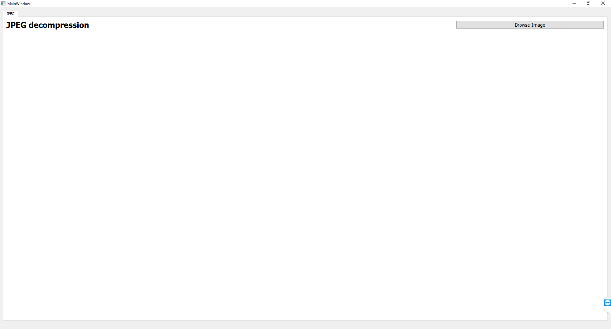
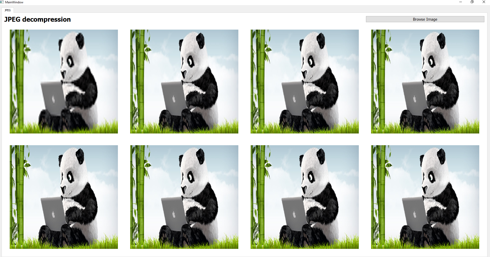
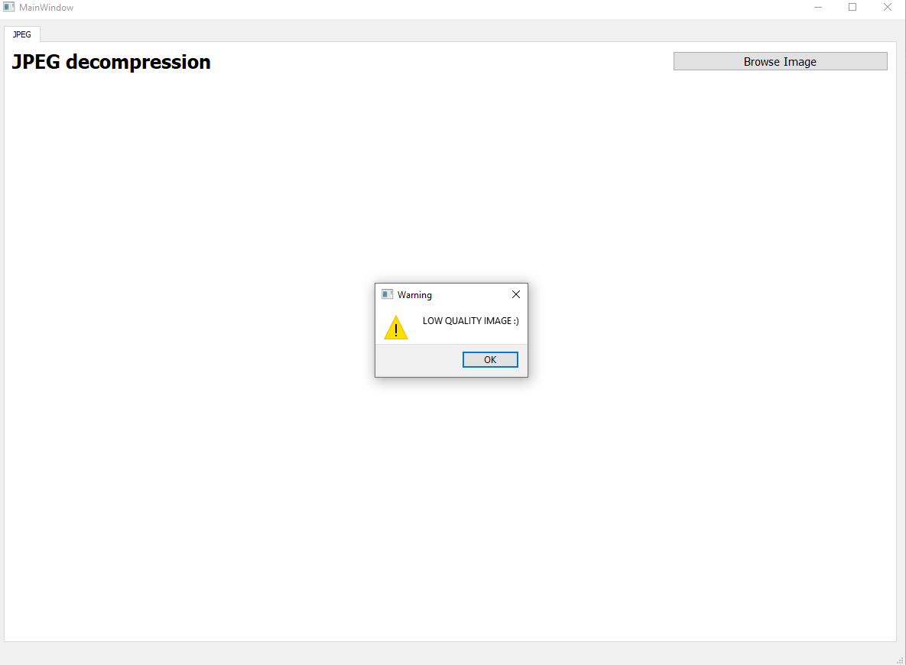

# Problem 2 [ JPEG Decoder ]

# Introduction 
This is an image (jpeg) decoder that shows the steps of decoding in 8 different views used pillow & openCv libraries to help me.
image loaded should be in jpeg-jpg format with a decent quality.
(samples folder containes some samples that any one can use)

# Method used
First we start reading image data in hexadecimal (0xff,0xda,...etc) and then look for (ffda) indexes as they represents the starting of image data, then using pyqtgraph showing this data from 0 to 1st index - 0 to 2nd index - 0 to 3rd index ... etc

# Dependencies and how to install them
- pip install opencv.python
- pip instal pillow

# Steps with Screenshots 

First, when the user run the program it will be opened like this

 

After importing image, immediately all 8 images will be plotted in the UI.

 

All outputs will be added to a folder called outputs in the main folder.

If the user choose a low quality image, popup window will be shown as warning

 

