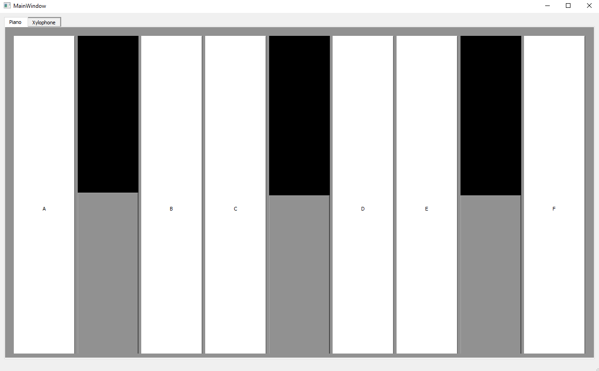
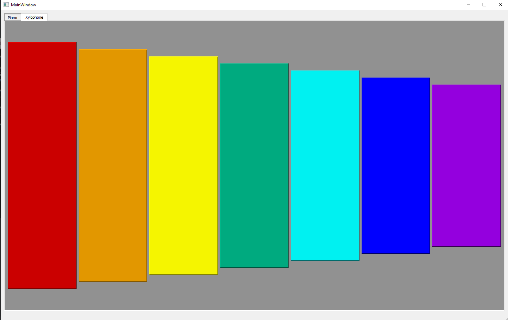

# Problem 3 [ Musical Instruments ]
# Introduction 
This is a music generator project built using the help of music21 library that generates music notes and then playing them using simpleaudio library that supports more than one channel to play music on, i built a piano and xylophone.

# Dependencies and how to install them
- pip install music21
- pip instal simpleaudio

# Steps with Screenshots 

 

clicking on each piano keyboard key will play a note similar to what this note sounds in real life

clicking on each xylophone metal bars will play a note similar to what this note sounds in real life
