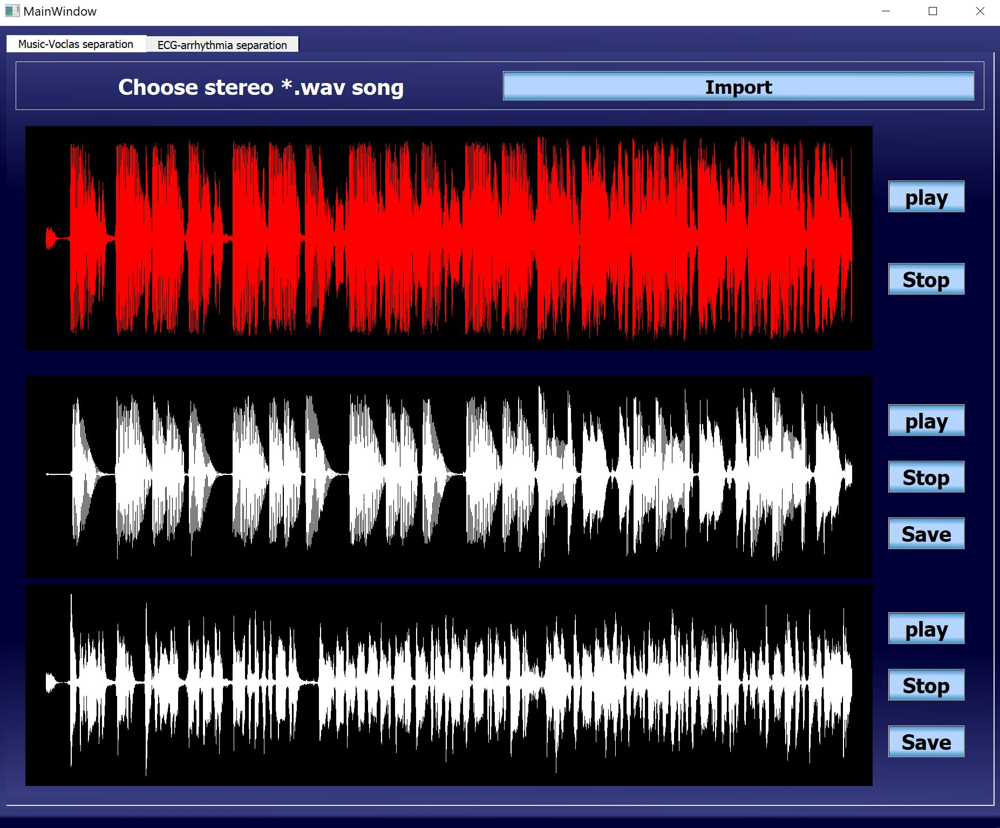
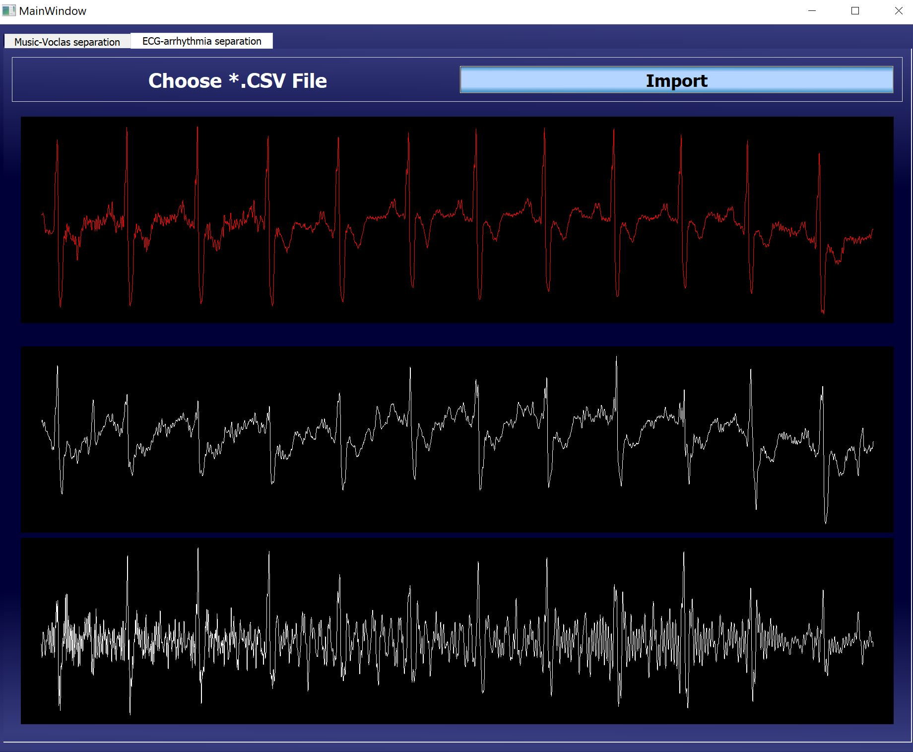

# Introduction
I used Spleeter library for vocal-music separation that can sparate:
- 2 stems  (music & vocals) 
- 4 stems  (musix & vocals & 2 types of instruments)
- 5 stems  (musix & vocals & 3 types of instruments)

as the user choose, in this project i chose 2 stems only.

I used librosa library for arrhythmia separation by STFT then applying two filters on the ecg file, one for extracting the pure ecg and the other for the arrhythmia. 

# Dependencies and how to install them 

using anaconda prompt type : 
- pip install spleeter
- pip install scipy
- pip install librosa
- pip install pandas
- pip install tensorflow 

# Steps 

- upload Stereo with exetention .wav file for music or .csv file for ECG 
- wait untill all plots is plotted 
- start doing whatever you want :) 

# Screenshots

when pressing play button beside any plot it will play this music , first plot is for whole song ,2nd is for music only , 3rd is for vocals only.

pressing save button will save either music or vocals in "outputs" folder located in the main folder. 

after importing right csv file plots will show, first plot is for whole ECG & arrhythmia ,2nd is for pure ECG , 3rd is for pure arrhythmia.